# 依赖关系图

```mermaid
graph TD
    subgraph Controller层
        IndexController[IndexController<br/>首页+职位详情]
        UserController[UserController<br/>登录/注册/登出]
        BossController[BossController<br/>Boss端全功能]
        JobController[JobController<br/>投递+记录]
        ResumeController[ResumeController<br/>简历管理]
        ChatController[ChatController<br/>聊天+文件]
        CaptchaController[CaptchaController<br/>验证码]
    end

    subgraph Service层
        UserService[UserService<br/>认证+注册]
        JobService[JobService<br/>职位CRUD+搜索]
        ApplicationService[ApplicationService<br/>投递逻辑]
        CompanyService[CompanyService<br/>公司管理]
        ResumeService[ResumeService<br/>简历CRUD]
        MessageService[MessageService<br/>聊天消息]
    end

    subgraph Repository层
        UserRepository
        JobRepository
        ApplicationRepository
        CompanyRepository
        ResumeRepository
        MessageRepository
    end

    subgraph Entity层
        User
        Job
        Application
        Company
        Resume
        Message
    end

    subgraph Config层
        WebConfig[WebConfig<br/>拦截器+资源]
        LoginInterceptor[LoginInterceptor<br/>认证拦截]
        WebSocketConfig[WebSocketConfig<br/>WS配置]
        PasswordEncoderConfig[PasswordEncoderConfig<br/>BCrypt]
        HttpsRedirectConfig[HttpsRedirectConfig<br/>HTTP→HTTPS]
    end

    subgraph Util层
        CaptchaUtil[CaptchaUtil<br/>验证码生成]
        CookieUtil[CookieUtil<br/>Cookie操作]
    end

    %% Controller → Service
    IndexController --> JobService
    IndexController --> CompanyService
    UserController --> UserService
    UserController --> CookieUtil
    BossController --> JobService
    BossController --> CompanyService
    BossController --> ApplicationService
    JobController --> JobService
    JobController --> ApplicationService
    ResumeController --> ResumeService
    ChatController --> MessageService
    ChatController --> ApplicationService
    ChatController --> JobService
    ChatController --> CompanyService
    CaptchaController --> CaptchaUtil

    %% Service → Repository
    UserService --> UserRepository
    JobService --> JobRepository
    JobService --> ApplicationRepository
    ApplicationService --> ApplicationRepository
    ApplicationService --> JobRepository
    ApplicationService --> ResumeRepository
    CompanyService --> CompanyRepository
    ResumeService --> ResumeRepository
    MessageService --> MessageRepository

    %% Config → Entity/Repository
    LoginInterceptor --> UserRepository
    LoginInterceptor --> User
    WebSocketConfig --> User

    %% Repository → Entity (隐式，所有 Repository 依赖 Entity)
    UserRepository -.-> User
    JobRepository -.-> Job
    ApplicationRepository -.-> Application
    CompanyRepository -.-> Company
    ResumeRepository -.-> Resume
    MessageRepository -.-> Message

    %% UserController → CaptchaController (static call)
    UserController -.-> CaptchaController
```



## 模块依赖方向
```
templates ← controller → service → repository → entity
                ↑            ↑           ↑
                ├── util     ├── entity  └── entity
                └── entity
```

**规则**: 依赖方向始终向下 (Controller → Service → Repository → Entity)，无循环依赖。
