# 微招（weib）总管理后台 — 系统架构设计文档

> 版本：v1.0 | 作者：高见远（Gao）| 日期：2026-05-29

---

## Part A：系统架构设计

---

## 1. 实现方案

### 1.1 核心挑战

| 挑战 | 分析 | 对策 |
|------|------|------|
| **认证体系并行** | 现有 Session + Cookie 认证服务于 Thymeleaf 页面，管理后台需 JWT Bearer 无状态认证，两者不能互相干扰 | 引入 Spring Security，双 SecurityFilterChain：Admin 链处理 `/api/admin/**`（JWT 无状态），透传链放行其他路径（由现有拦截器接管） |
| **RBAC 三级权限** | super_admin（全权限）、auditor（审核权限）、viewer（只读）需精确控制 API 访问 | 方法级注解 `@PreAuthorize` + 数据库 AdminRole 表，在 JWT Token 中嵌入 adminRole |
| **现有数据软扩展** | User/Company/Job 表需加字段但不能破坏现有功能 | JPA `ddl-auto: update` 自动加列 + 数据库迁移 SQL 回填默认值 |
| **前后端分离嵌入** | React SPA 需嵌入 Spring Boot 单体部署，开发时需跨域代理 | 生产：`static/admin/` 静态资源；开发：Vite proxy → `localhost:8888` |
| **仪表盘性能** | 大量聚合查询影响性能 | `@Scheduled` 每 5 分钟预计算缓存到内存 Map，API 直接读缓存 |

### 1.2 框架选型

| 层级 | 技术 | 版本 | 选型理由 |
|------|------|------|----------|
| **安全框架** | Spring Boot Starter Security | 3.2.5（跟随 parent） | 需新增依赖；提供 SecurityFilterChain、@PreAuthorize、CORS 配置能力 |
| **JWT** | jjwt (io.jsonwebtoken) | 0.12.5 | 已在 pom.xml 中，复用现有依赖，无需新增 |
| **前端构建** | Vite | ^5.4 | 快速 HMR，TypeScript 原生支持 |
| **前端框架** | React | ^18.3 | PRD 指定 |
| **UI 组件库** | MUI (Material UI) | ^5.16 | PRD 指定；提供 DataGrid、Skeleton、Snackbar、Drawer |
| **CSS 框架** | Tailwind CSS | ^3.4 | PRD 指定；用于布局和间距 |
| **HTTP 客户端** | axios | ^1.7 | 拦截器统一处理 JWT 和错误 |
| **图表** | recharts | ^2.12 | React 原生图表库，轻量 |
| **前端路由** | react-router-dom | ^6.26 | SPA 路由 |
| **状态管理** | React Context + useReducer | 内置 | 管理端状态简单，无需 Zustand/Redux |
| **日期处理** | dayjs | ^1.11 | 轻量（2KB），替代 moment.js |

### 1.3 架构模式

```
┌──────────────────────────────────────────────────────┐
│                    Spring Boot :8888                   │
│                                                       │
│  ┌──────────────────┐    ┌────────────────────────┐  │
│  │  SecurityFilter   │    │  SecurityFilter         │  │
│  │  Chain #1 (Order=1)│    │  Chain #2 (Order=2)     │  │
│  │  /api/admin/**     │    │  /** (passthrough)      │  │
│  │  JWT Stateless     │    │  → LoginInterceptor     │  │
│  │  @PreAuthorize     │    │  → CsrfInterceptor      │  │
│  └────────┬───────────┘    └──────────┬─────────────┘  │
│           │                            │                │
│  ┌────────▼────────────────────────────▼─────────────┐ │
│  │               Controller 层                         │ │
│  │  com.weib.controller.admin/  │  com.weib.controller/│ │
│  │  (REST @RestController)      │  (Thymeleaf @Ctrl)   │ │
│  └────────┬──────────────────────┬───────────────────┘ │
│           │                       │                      │
│  ┌────────▼──────────────────────▼───────────────────┐ │
│  │                Service 层                           │ │
│  │  com.weib.service.admin/  │  com.weib.service/      │ │
│  └────────┬──────────────────────┬───────────────────┘ │
│           │                       │                      │
│  ┌────────▼──────────────────────▼───────────────────┐ │
│  │              Repository 层 (Spring Data JPA)        │ │
│  └──────────────────────┬────────────────────────────┘ │
│                          │                               │
│  ┌──────────────────────▼────────────────────────────┐ │
│  │              Entity 层 + MySQL                      │ │
│  └───────────────────────────────────────────────────┘ │
│                                                       │
│  ┌──────────────────────────────────────────────────┐ │
│  │  静态资源: /admin/ → static/admin/ (React SPA)     │ │
│  └──────────────────────────────────────────────────┘ │
└──────────────────────────────────────────────────────┘
```

---

## 2. 文件列表

### 2.1 后端新建文件

```
src/main/java/com/weib/
├── config/
│   ├── AdminSecurityConfig.java          ← 管理员安全链配置
│   └── CorsConfig.java                   ← CORS 配置
├── controller/admin/
│   ├── AdminAuthController.java          ← 管理员登录/登出/身份
│   ├── AdminDashboardController.java     ← 仪表盘数据
│   ├── AdminCompanyController.java       ← 公司审核
│   ├── AdminJobController.java           ← 职位审核 + 批量下架
│   ├── AdminUserController.java          ← 用户管理 + 封禁/解封
│   ├── AdminAdminController.java         ← 子管理员管理
│   ├── AdminAuditLogController.java      ← 操作日志查询
│   └── AdminExportController.java        ← CSV 导出
├── dto/admin/
│   ├── LoginRequest.java                 ← 登录请求 DTO
│   ├── LoginResponse.java                ← 登录响应 DTO
│   ├── DashboardStatsResponse.java       ← 仪表盘统计响应 DTO
│   ├── CompanyListResponse.java          ← 公司列表响应 DTO
│   ├── JobListResponse.java              ← 职位列表响应 DTO
│   ├── UserListResponse.java             ← 用户列表响应 DTO
│   ├── UserDetailResponse.java           ← 用户详情响应 DTO
│   ├── CreateAdminRequest.java           ← 创建子管理员请求 DTO
│   ├── AuditLogResponse.java             ← 审核日志响应 DTO
│   └── PageResponse.java                 ← 通用分页包装 DTO
├── entity/
│   ├── AdminRole.java                    ← 管理员角色实体
│   └── AuditLog.java                     ← 审核日志实体
├── repository/
│   ├── AdminRoleRepository.java          ← 管理员角色仓库
│   └── AuditLogRepository.java           ← 审核日志仓库
├── security/
│   └── AdminJwtAuthenticationFilter.java ← JWT 认证过滤器
└── service/admin/
    ├── AdminAuthService.java             ← 管理员认证服务
    ├── DashboardService.java             ← 仪表盘统计服务
    ├── AdminCompanyService.java          ← 公司审核服务
    ├── AdminJobService.java              ← 职位审核服务
    ├── AdminUserService.java             ← 用户管理服务
    ├── AdminAdminService.java            ← 子管理员管理服务
    ├── AuditLogService.java              ← 操作日志服务
    └── CsvExportService.java             ← CSV 导出服务

src/main/resources/
├── db/
│   └── migration.sql                     ← 数据库迁移脚本（含管理员初始化）
```

### 2.2 后端修改文件

```
src/main/java/com/weib/
├── entity/
│   ├── User.java              ← 修改：role 字符串支持 "admin" + 增加 status 字段
│   ├── Company.java           ← 修改：增加 auditStatus、auditReason 字段
│   └── Job.java               ← 修改：增加 auditStatus、auditReason 字段
├── repository/
│   ├── UserRepository.java    ← 修改：增加管理员查询方法
│   ├── CompanyRepository.java ← 修改：增加审核查询方法
│   └── JobRepository.java     ← 修改：增加审核查询方法
├── config/
│   └── WebConfig.java         ← 修改：拦截器排除 /api/admin/**
├── service/
│   └── NotificationService.java ← 修改：增加管理员发通知方法（P1 通知联动）
├── exception/
│   └── GlobalExceptionHandler.java ← 修改：增加 @ExceptionHandler 适配管理 API
├── util/
│   └── JwtUtil.java           ← 修改：增加 adminToken 生成/验证方法

pom.xml                         ← 修改：增加 spring-boot-starter-security 依赖
src/main/resources/application.yml ← 修改：增加 jwt.admin-secret、admin 初始化配置
```

### 2.3 前端新建文件

```
admin-frontend/
├── package.json
├── vite.config.ts
├── tailwind.config.ts
├── postcss.config.js
├── tsconfig.json
├── tsconfig.node.json
├── index.html
├── src/
│   ├── main.tsx                        ← React 入口
│   ├── App.tsx                         ← 路由 + AuthProvider
│   ├── vite-env.d.ts
│   ├── api/
│   │   ├── client.ts                   ← axios 实例（JWT 拦截器）
│   │   ├── auth.ts                     ← 认证 API
│   │   ├── dashboard.ts                ← 仪表盘 API
│   │   ├── companies.ts                ← 公司审核 API
│   │   ├── jobs.ts                     ← 职位审核 API
│   │   ├── users.ts                    ← 用户管理 API
│   │   ├── admins.ts                   ← 子管理员 API
│   │   └── auditLogs.ts               ← 操作日志 API
│   ├── context/
│   │   └── AuthContext.tsx             ← 认证上下文（login/logout/me）
│   ├── components/
│   │   ├── AdminLayout.tsx             ← 整体布局（Sidebar + Navbar + Content）
│   │   ├── AdminSidebar.tsx            ← 侧边栏导航
│   │   ├── AdminNavbar.tsx             ← 顶部导航栏
│   │   ├── StatCard.tsx                ← 指标卡片组件
│   │   ├── ConfirmDialog.tsx           ← 确认弹窗组件
│   │   ├── RejectDialog.tsx            ← 驳回理由弹窗组件
│   │   └── ProtectedRoute.tsx          ← 路由守卫组件
│   ├── pages/
│   │   ├── LoginPage.tsx               ← 管理员登录页
│   │   ├── DashboardPage.tsx           ← 仪表盘
│   │   ├── CompanyAuditPage.tsx        ← 公司审核列表
│   │   ├── JobAuditPage.tsx            ← 职位审核列表
│   │   ├── UserManagementPage.tsx      ← 用户管理列表
│   │   ├── UserDetailDrawer.tsx        ← 用户详情抽屉
│   │   ├── AdminManagementPage.tsx     ← 子管理员管理
│   │   └── AuditLogPage.tsx            ← 操作日志列表
│   ├── types/
│   │   └── index.ts                    ← TypeScript 类型定义
│   └── utils/
│       └── index.ts                    ← 工具函数（格式化等）
```

---

## 3. 数据库设计

### 3.1 完整 DDL（新增 + 变更）

```sql
-- ============================================
-- 1. User 表变更
-- ============================================
-- role 字段已是 VARCHAR(20)，无需 DDL 变更结构
-- 但需确认 MySQL ENUM 约束不会阻塞 "admin" 值
-- 如果已是纯 VARCHAR，直接可用；如果是 ENUM，执行：
-- ALTER TABLE users MODIFY COLUMN role VARCHAR(20) NOT NULL DEFAULT 'seeker';

-- 新增 status 字段用于封禁标记
ALTER TABLE users ADD COLUMN IF NOT EXISTS status VARCHAR(20) NOT NULL DEFAULT 'active';
-- 索引：按角色+状态筛选
CREATE INDEX IF NOT EXISTS idx_users_role_status ON users(role, status);
-- 索引：按用户名搜索
CREATE INDEX IF NOT EXISTS idx_users_username ON users(username);

-- 回填：已有用户 status = 'active'
UPDATE users SET status = 'active' WHERE status IS NULL;

-- ============================================
-- 2. Company 表变更
-- ============================================
ALTER TABLE companies ADD COLUMN IF NOT EXISTS audit_status VARCHAR(20) NOT NULL DEFAULT 'pending';
ALTER TABLE companies ADD COLUMN IF NOT EXISTS audit_reason VARCHAR(500);
-- 索引：按审核状态筛选
CREATE INDEX IF NOT EXISTS idx_companies_audit_status ON companies(audit_status);
-- 回填：已有公司全部标记为 approved
UPDATE companies SET audit_status = 'approved' WHERE audit_status = 'pending' AND id IS NOT NULL;

-- ============================================
-- 3. Job 表变更
-- ============================================
ALTER TABLE jobs ADD COLUMN IF NOT EXISTS audit_status VARCHAR(20) NOT NULL DEFAULT 'pending';
ALTER TABLE jobs ADD COLUMN IF NOT EXISTS audit_reason VARCHAR(500);
-- 索引：按审核状态筛选
CREATE INDEX IF NOT EXISTS idx_jobs_audit_status ON jobs(audit_status);
-- 回填：已有职位全部标记为 approved
UPDATE jobs SET audit_status = 'approved' WHERE audit_status = 'pending' AND id IS NOT NULL;

-- ============================================
-- 4. 管理员角色表（新建）
-- ============================================
CREATE TABLE IF NOT EXISTS admin_roles (
    id BIGINT PRIMARY KEY AUTO_INCREMENT,
    user_id BIGINT NOT NULL UNIQUE,
    role_type VARCHAR(20) NOT NULL DEFAULT 'viewer',
    created_at DATETIME NOT NULL,
    CONSTRAINT fk_admin_roles_user FOREIGN KEY (user_id) REFERENCES users(id)
);
CREATE INDEX IF NOT EXISTS idx_admin_roles_user_id ON admin_roles(user_id);

-- ============================================
-- 5. 审核操作日志表（新建）
-- ============================================
CREATE TABLE IF NOT EXISTS audit_logs (
    id BIGINT PRIMARY KEY AUTO_INCREMENT,
    admin_id BIGINT NOT NULL,
    action VARCHAR(50) NOT NULL,
    target_type VARCHAR(32) NOT NULL,
    target_id BIGINT,
    reason TEXT,
    created_at DATETIME NOT NULL,
    CONSTRAINT fk_audit_logs_admin FOREIGN KEY (admin_id) REFERENCES users(id)
);
CREATE INDEX IF NOT EXISTS idx_audit_logs_admin_id ON audit_logs(admin_id);
CREATE INDEX IF NOT EXISTS idx_audit_logs_action ON audit_logs(action);
CREATE INDEX IF NOT EXISTS idx_audit_logs_created_at ON audit_logs(created_at);
CREATE INDEX IF NOT EXISTS idx_audit_logs_target ON audit_logs(target_type, target_id);

-- ============================================
-- 6. 初始化超级管理员（默认账号）
-- ============================================
-- 密码: Admin@123456 (BCrypt 加密)
INSERT INTO users (username, password, role, nickname, status, created_at, updated_at)
SELECT 'admin', '$2a$10$N9qo8uLOickgx2ZMRZoMyeIjZAgcfl7p92ldGxad68LJZdL17lhWy', 'admin', '超级管理员', 'active', NOW(), NOW()
WHERE NOT EXISTS (SELECT 1 FROM users WHERE username = 'admin');

INSERT INTO admin_roles (user_id, role_type, created_at)
SELECT id, 'super_admin', NOW() FROM users WHERE username = 'admin'
AND NOT EXISTS (SELECT 1 FROM admin_roles ar JOIN users u ON ar.user_id = u.id WHERE u.username = 'admin');
```

### 3.2 索引设计汇总

| 表 | 索引名 | 列 | 用途 |
|----|--------|----|------|
| users | idx_users_role_status | (role, status) | 用户列表筛选 |
| users | idx_users_username | (username) | 用户名搜索 |
| companies | idx_companies_audit_status | (audit_status) | 审核列表筛选 |
| jobs | idx_jobs_audit_status | (audit_status) | 审核列表筛选 |
| admin_roles | idx_admin_roles_user_id | (user_id) | 管理员角色查询 |
| audit_logs | idx_audit_logs_admin_id | (admin_id) | 按操作人查询 |
| audit_logs | idx_audit_logs_action | (action) | 按操作类型查询 |
| audit_logs | idx_audit_logs_created_at | (created_at) | 按时间排序 |
| audit_logs | idx_audit_logs_target | (target_type, target_id) | 按目标查询 |

---

## 4. API 接口设计

> 所有 API 前缀：`/api/admin`，认证方式：`Authorization: Bearer <token>`

### 4.1 统一响应格式

```json
{
  "code": 200,
  "msg": "操作成功",
  "data": { }
}
```

| code | 含义 |
|------|------|
| 200 | 成功 |
| 400 | 请求参数错误 |
| 401 | 未认证 / Token 过期 |
| 403 | 无权限 |
| 404 | 资源不存在 |
| 500 | 服务器内部错误 |

### 4.2 分页格式

```json
{
  "code": 200,
  "msg": "操作成功",
  "data": {
    "content": [...],
    "totalElements": 150,
    "totalPages": 8,
    "currentPage": 1,
    "pageSize": 20
  }
}
```

### 4.3 API 端点清单

#### 认证（AdminAuthController）

| 方法 | 路径 | 权限 | 描述 | 请求体 | 响应 data |
|------|------|------|------|--------|-----------|
| POST | `/api/admin/auth/login` | 无 | 管理员登录 | `{username, password}` | `{token, admin: {id, username, nickname, roleType}}` |
| GET | `/api/admin/auth/me` | admin | 获取当前管理员信息 | — | `{id, username, nickname, roleType}` |
| POST | `/api/admin/auth/logout` | admin | 登出 | — | null |

#### 仪表盘（AdminDashboardController）

| 方法 | 路径 | 权限 | 描述 | 查询参数 | 响应 data |
|------|------|------|------|----------|-----------|
| GET | `/api/admin/dashboard/stats` | admin | 核心指标卡片 | — | `{totalUsers, totalJobs, todayNewUsers, pendingCount}` |
| GET | `/api/admin/dashboard/charts` | admin | 图表数据 | — | `{userGrowth: [{date, count}], jobDistribution: [{industry, count}]}` |
| GET | `/api/admin/dashboard/recent-logs` | super_admin, auditor | 最近审核记录 | `?limit=10` | `[{id, action, targetType, adminName, createdAt}]` |

#### 公司审核（AdminCompanyController）

| 方法 | 路径 | 权限 | 描述 | 查询参数/请求体 | 响应 data |
|------|------|------|------|------|-----------|
| GET | `/api/admin/companies` | admin | 公司列表 | `?page=0&size=20&status=&industry=&keyword=` | 分页结果 |
| GET | `/api/admin/companies/{id}` | admin | 公司详情 | — | `{id, name, industry, scale, address, description, bossName, auditStatus, auditReason, createdAt}` |
| PUT | `/api/admin/companies/{id}/approve` | super_admin, auditor | 通过审核 | — | null |
| PUT | `/api/admin/companies/{id}/reject` | super_admin, auditor | 驳回审核 | `{reason}` | null |

#### 职位审核（AdminJobController）

| 方法 | 路径 | 权限 | 描述 | 查询参数/请求体 | 响应 data |
|------|------|------|------|------|-----------|
| GET | `/api/admin/jobs` | admin | 职位列表 | `?page=0&size=20&status=&keyword=` | 分页结果（含公司名） |
| GET | `/api/admin/jobs/{id}` | admin | 职位详情 | — | 职位完整信息 + 公司名 + bossName |
| PUT | `/api/admin/jobs/{id}/approve` | super_admin, auditor | 通过审核 | — | null |
| PUT | `/api/admin/jobs/{id}/reject` | super_admin, auditor | 驳回审核 | `{reason}` | null |
| POST | `/api/admin/jobs/batch-offline` | super_admin, auditor | 批量下架 | `{ids: [1,2,3]}` | `{successCount}` |

#### 用户管理（AdminUserController）

| 方法 | 路径 | 权限 | 描述 | 查询参数/请求体 | 响应 data |
|------|------|------|------|------|-----------|
| GET | `/api/admin/users` | admin | 用户列表 | `?page=0&size=20&role=&status=&keyword=` | 分页结果 |
| GET | `/api/admin/users/{id}` | admin | 用户详情 | — | `{id, username, nickname, phone, role, status, resumeCount, applicationCount, createdAt}` |
| PUT | `/api/admin/users/{id}/ban` | super_admin | 封禁用户 | — | null |
| PUT | `/api/admin/users/{id}/unban` | super_admin | 解封用户 | — | null |

#### 子管理员管理（AdminAdminController）

| 方法 | 路径 | 权限 | 描述 | 请求体 | 响应 data |
|------|------|------|------|------|-----------|
| GET | `/api/admin/admins` | super_admin | 子管理员列表 | — | `[{userId, username, nickname, roleType, createdAt}]` |
| POST | `/api/admin/admins` | super_admin | 创建子管理员 | `{username, password, roleType}` | `{id, username, roleType}` |
| PUT | `/api/admin/admins/{userId}` | super_admin | 修改子管理员角色 | `{roleType}` | null |
| PUT | `/api/admin/admins/{userId}/disable` | super_admin | 禁用子管理员 | — | null |

#### 操作日志（AdminAuditLogController）

| 方法 | 路径 | 权限 | 描述 | 查询参数 | 响应 data |
|------|------|------|------|------|-----------|
| GET | `/api/admin/audit-logs` | super_admin, auditor | 日志列表 | `?page=0&size=20&action=&adminId=&startDate=&endDate=` | 分页结果 |

#### CSV 导出（AdminExportController）

| 方法 | 路径 | 权限 | 描述 | 查询参数 | 响应 |
|------|------|------|------|------|------|
| GET | `/api/admin/export/users` | super_admin, auditor | 导出用户 CSV | `?role=&status=&keyword=` | `Content-Type: text/csv; charset=UTF-8` |
| GET | `/api/admin/export/audit-logs` | super_admin, auditor | 导出操作日志 CSV | `?action=&adminId=&startDate=&endDate=` | `Content-Type: text/csv; charset=UTF-8` |

---

## 5. 安全架构

### 5.1 双 SecurityFilterChain 配置

```java
// AdminSecurityConfig.java

@Configuration
@EnableMethodSecurity  // 启用 @PreAuthorize
public class AdminSecurityConfig {

    // Chain #1 — 管理后台 API（高优先级）
    @Bean
    @Order(1)
    public SecurityFilterChain adminFilterChain(HttpSecurity http) {
        http
            .securityMatcher("/api/admin/**")
            .csrf(csrf -> csrf.disable())          // JWT 无 CSRF 风险
            .sessionManagement(sm -> sm
                .sessionCreationPolicy(SessionCreationPolicy.STATELESS))
            .authorizeHttpRequests(auth -> auth
                .requestMatchers("/api/admin/auth/login").permitAll()
                .requestMatchers(HttpMethod.GET, "/api/admin/dashboard/**").hasRole("ADMIN")
                .requestMatchers("/api/admin/companies/**").hasAnyRole("SUPER_ADMIN", "AUDITOR")
                .requestMatchers("/api/admin/jobs/**").hasAnyRole("SUPER_ADMIN", "AUDITOR")
                .requestMatchers("/api/admin/users/**").hasRole("SUPER_ADMIN")
                .requestMatchers("/api/admin/admins/**").hasRole("SUPER_ADMIN")
                .requestMatchers("/api/admin/audit-logs/**").hasAnyRole("SUPER_ADMIN", "AUDITOR")
                .requestMatchers("/api/admin/export/**").hasAnyRole("SUPER_ADMIN", "AUDITOR")
                .anyRequest().authenticated()
            )
            .addFilterBefore(adminJwtFilter, UsernamePasswordAuthenticationFilter.class);
        return http.build();
    }

    // Chain #2 — 透传链（低优先级），所有其他路径由现有拦截器处理
    @Bean
    @Order(2)
    public SecurityFilterChain passThroughFilterChain(HttpSecurity http) {
        http
            .securityMatcher("/**")
            .authorizeHttpRequests(auth -> auth.anyRequest().permitAll());
        return http.build();
    }
}
```

**关键要点**：
- `Chain #1` (`@Order(1)`) 精确匹配 `/api/admin/**`，JWT 无状态认证
- `Chain #2` (`@Order(2)`) 对所有路径 `permitAll()`，实际认证由 `LoginInterceptor` + `CsrfInterceptor` 处理
- 两者互不干扰：Spring Security 按 Order 依次尝试匹配，匹配成功则停止

### 5.2 JWT Token 设计

```json
// Admin JWT Claims 结构
{
  "sub": "1",                        // 用户 ID
  "username": "admin",               // 用户名
  "adminRole": "super_admin",        // 管理员角色（super_admin / auditor / viewer）
  "iat": 1716998400,                 // 签发时间
  "exp": 1717005600                  // 过期时间（2 小时）
}
```

| 属性 | 值 |
|------|------|
| 签名算法 | HS256 (HMAC-SHA256) |
| 有效期 | 2 小时（7200 秒） |
| 密钥 | `${jwt.admin-secret}`（独立于现有 jwt.secret） |
| 传输方式 | `Authorization: Bearer <token>` |
| 刷新策略 | P0 无 refresh token（过期重新登录）；P1 可加入 refresh |

### 5.3 CORS 配置

```java
@Configuration
public class CorsConfig {
    @Bean
    public CorsConfigurationSource corsConfigurationSource() {
        CorsConfiguration config = new CorsConfiguration();
        config.setAllowedOrigins(List.of(
            "http://localhost:5173",    // Vite 开发服务器
            "https://localhost:8443"     // 生产同域（如果跨端口）
        ));
        config.setAllowedMethods(List.of("GET", "POST", "PUT", "DELETE", "OPTIONS"));
        config.setAllowedHeaders(List.of("Authorization", "Content-Type"));
        config.setAllowCredentials(true);
        config.setMaxAge(3600L);

        UrlBasedCorsConfigurationSource source = new UrlBasedCorsConfigurationSource();
        source.registerCorsConfiguration("/api/admin/**", config);
        return source;
    }
}
```

**注意**：生产环境同域部署（`static/admin/`）时，CORS 配置自动不生效（同源请求不触发 CORS 检查）。

### 5.4 权限校验方案

采用两级权限控制：

1. **SecurityFilterChain 级别**：基于 URL 模式粗粒度控制（见 5.1）
2. **方法级别**：`@PreAuthorize` 细粒度控制敏感操作

```java
// 示例：封禁用户需要 super_admin
@PreAuthorize("hasRole('SUPER_ADMIN')")
@PutMapping("/{id}/ban")
public Result<Void> banUser(@PathVariable Long id) { ... }
```

JWT Filter 将 token 中的 `adminRole` 映射为 Spring Security 的 `GrantedAuthority`：

| adminRole | Spring Security Role |
|-----------|---------------------|
| super_admin | ROLE_SUPER_ADMIN |
| auditor | ROLE_AUDITOR |
| viewer | ROLE_VIEWER |

所有三种角色都拥有 `ROLE_ADMIN` 基础角色。

### 5.5 与现有拦截器的协调

修改 `WebConfig.java`，将 `/api/admin/**` 从 `CsrfInterceptor` 和 `LoginInterceptor` 中排除：

```java
// CsrfInterceptor 排除管理 API
registry.addInterceptor(csrfInterceptor)
    .addPathPatterns("/login", "/register", ...)
    .excludePathPatterns("/api/admin/**");  // ← 新增

// LoginInterceptor 排除管理 API
registry.addInterceptor(loginInterceptor)
    .addPathPatterns("/**")
    .excludePathPatterns(
        "/login", "/register", ...
        "/api/admin/**"  // ← 新增
    );
```

---

## 6. Anything UNCLEAR（待明确事项）

| # | 问题 | 当前假设 |
|---|------|----------|
| Q1 | 管理员 JWT 是否需要 refresh token 机制？ | 假设 P0 不需要，2 小时过期后重新登录 |
| Q2 | User 表的 `role` 字段在 MySQL 中是否已是 ENUM 类型？ | 假设是 VARCHAR（从 JPA `@Column(length=20)` 推断），如果是 ENUM 则需 ALTER TABLE 扩展 |
| Q3 | 前端 build 产物放置路径：`static/admin/` 下是直接放文件还是放一个子目录？ | 假设直接放 `static/admin/`，`index.html` 在 `static/admin/index.html` |
| Q4 | 仪表盘缓存是否需要持久化（如 Redis）还是内存即可？ | 假设内存 `ConcurrentHashMap` + `@Scheduled` 即可，单机部署场景 |
| Q5 | "封禁用户" 是否等同于 "禁止登录"（通过 status 字段 + UserService 检查）？ | 假设是：需要在现有 `UserService.login()` 中增加 `status='banned'` 检查 |
| Q6 | 子管理员被禁用后，JWT 是否还能用？ | 假设禁用是软操作（修改 status），JWT 在有效期内仍可用；严格模式可在 JWT Filter 中实时查库校验 |
| Q7 | Company 审核通过后，Boss 的职位是否自动变为可见？ | 假设：Company 审核通过后，其下所有 `audit_status='pending'` 的 Job 不自动变更，需单独审核 |
| Q8 | 批量下架是否也走审核流程？ | 假设：批量下架是直接操作（super_admin/auditor 权限），操作记录到 audit_log |

---

## Part B：任务分解

---

## 6. Required Packages

### 6.1 Maven 依赖（新增）

```
- org.springframework.boot:spring-boot-starter-security  (跟随 spring-boot-starter-parent 3.2.5)
```

> `spring-boot-starter-security` 提供 SecurityFilterChain、@PreAuthorize、CORS 配置等。现有 `spring-security-crypto` 保留不变。

### 6.2 NPM 依赖（前端）

```
- react@^18.3.1: UI 框架
- react-dom@^18.3.1: React DOM 渲染
- react-router-dom@^6.26.0: SPA 路由
- @mui/material@^5.16.0: Material UI 组件库
- @mui/icons-material@^5.16.0: MUI 图标集
- @mui/x-data-grid@^7.12.0: MUI 数据表格（分页、排序、筛选）
- @emotion/react@^11.13.0: MUI 依赖
- @emotion/styled@^11.13.0: MUI 依赖
- axios@^1.7.0: HTTP 客户端
- recharts@^2.12.0: 图表库（折线图、饼图）
- dayjs@^1.11.0: 日期格式化
- tailwindcss@^3.4.0: CSS 工具类
- autoprefixer@^10.4.0: PostCSS 插件
- postcss@^8.4.0: CSS 处理器
- @types/react@^18.3.0: TypeScript 类型
- @types/react-dom@^18.3.0: TypeScript 类型
- typescript@^5.5.0: TypeScript 编译器
- vite@^5.4.0: 构建工具
- @vitejs/plugin-react@^4.3.0: Vite React 插件
```

---

## 7. Task List（按依赖顺序排列）

### T01 — 项目基础设施与数据层

| 属性 | 内容 |
|------|------|
| **Task ID** | T01 |
| **Task Name** | 项目基础设施与数据层 |
| **Dependencies** | 无 |
| **Priority** | P0 |

**Source Files**：

后端：
- `pom.xml` — 新增 `spring-boot-starter-security` 依赖
- `src/main/resources/application.yml` — 新增 `jwt.admin-secret`、`admin.default-password` 配置
- `src/main/resources/db/migration.sql` — 完整 DDL + 数据回填 + 管理员初始化
- `src/main/java/com/weib/entity/User.java` — 增加 `status` 字段
- `src/main/java/com/weib/entity/Company.java` — 增加 `auditStatus`、`auditReason` 字段
- `src/main/java/com/weib/entity/Job.java` — 增加 `auditStatus`、`auditReason` 字段
- `src/main/java/com/weib/entity/AdminRole.java` — 新建管理员角色实体
- `src/main/java/com/weib/entity/AuditLog.java` — 新建审核日志实体
- `src/main/java/com/weib/repository/AdminRoleRepository.java` — 新建
- `src/main/java/com/weib/repository/AuditLogRepository.java` — 新建
- `src/main/java/com/weib/repository/UserRepository.java` — 增加管理员/封禁相关查询方法
- `src/main/java/com/weib/repository/CompanyRepository.java` — 增加审核查询方法
- `src/main/java/com/weib/repository/JobRepository.java` — 增加审核查询方法
- `src/main/java/com/weib/config/WebConfig.java` — 拦截器排除 `/api/admin/**`

前端：
- `admin-frontend/package.json` — 项目配置 + 依赖声明
- `admin-frontend/vite.config.ts` — Vite 配置（proxy 到 `localhost:8888`）
- `admin-frontend/tailwind.config.ts` — Tailwind 配置
- `admin-frontend/postcss.config.js` — PostCSS 配置
- `admin-frontend/tsconfig.json` — TypeScript 配置
- `admin-frontend/tsconfig.node.json` — Node TypeScript 配置
- `admin-frontend/index.html` — HTML 入口
- `admin-frontend/src/vite-env.d.ts` — Vite 类型声明

**开发建议**：先执行 `migration.sql` 完成数据库变更，再启动 Spring Boot 让 JPA `ddl-auto: update` 同步实体变更。

---

### T02 — 安全配置与核心服务

| 属性 | 内容 |
|------|------|
| **Task ID** | T02 |
| **Task Name** | 安全配置与核心服务 |
| **Dependencies** | T01（需要实体和 Repository 就绪） |
| **Priority** | P0 |

**Source Files**：
- `src/main/java/com/weib/config/AdminSecurityConfig.java` — 双 SecurityFilterChain + @EnableMethodSecurity
- `src/main/java/com/weib/config/CorsConfig.java` — CORS 配置
- `src/main/java/com/weib/security/AdminJwtAuthenticationFilter.java` — JWT 认证过滤器（OncePerRequestFilter）
- `src/main/java/com/weib/util/JwtUtil.java` — 增加 `generateAdminToken()`、`validateAdminToken()` 方法
- `src/main/java/com/weib/service/admin/AdminAuthService.java` — 管理员登录验证、锁定检查、BCrypt 校验
- `src/main/java/com/weib/service/admin/DashboardService.java` — 仪表盘统计 + `@Scheduled` 5分钟缓存
- `src/main/java/com/weib/service/admin/AuditLogService.java` — 审核日志记录与查询
- `src/main/java/com/weib/service/NotificationService.java` — 增加管理员发通知方法（P1 通知联动）
- `src/main/java/com/weib/dto/admin/LoginRequest.java` — 登录请求 DTO
- `src/main/java/com/weib/dto/admin/LoginResponse.java` — 登录响应 DTO
- `src/main/java/com/weib/dto/admin/DashboardStatsResponse.java` — 仪表盘统计 DTO
- `src/main/java/com/weib/dto/admin/PageResponse.java` — 通用分页包装 DTO
- `src/main/java/com/weib/exception/GlobalExceptionHandler.java` — 增加 `AccessDeniedException`、`AuthenticationException` 处理

---

### T03 — 管理 API 控制器与业务服务

| 属性 | 内容 |
|------|------|
| **Task ID** | T03 |
| **Task Name** | 管理 API 控制器与业务服务 |
| **Dependencies** | T02（需要安全配置和基础服务就绪） |
| **Priority** | P0 |

**Source Files**：
- `src/main/java/com/weib/service/admin/AdminCompanyService.java` — 公司审核业务（通过/驳回 + 记录日志 + 发通知）
- `src/main/java/com/weib/service/admin/AdminJobService.java` — 职位审核业务（通过/驳回/批量下架 + 日志 + 通知）
- `src/main/java/com/weib/service/admin/AdminUserService.java` — 用户管理业务（列表/详情/封禁/解封 + 日志）
- `src/main/java/com/weib/service/admin/AdminAdminService.java` — 子管理员管理业务（CRUD + 角色分配）
- `src/main/java/com/weib/service/admin/CsvExportService.java` — CSV 导出服务
- `src/main/java/com/weib/controller/admin/AdminAuthController.java` — 登录/登出/身份
- `src/main/java/com/weib/controller/admin/AdminDashboardController.java` — 仪表盘 API
- `src/main/java/com/weib/controller/admin/AdminCompanyController.java` — 公司审核 API
- `src/main/java/com/weib/controller/admin/AdminJobController.java` — 职位审核 API
- `src/main/java/com/weib/controller/admin/AdminUserController.java` — 用户管理 API
- `src/main/java/com/weib/controller/admin/AdminAdminController.java` — 子管理员管理 API
- `src/main/java/com/weib/controller/admin/AdminAuditLogController.java` — 操作日志 API
- `src/main/java/com/weib/controller/admin/AdminExportController.java` — CSV 导出 API
- `src/main/java/com/weib/dto/admin/CompanyListResponse.java` — 公司列表 DTO
- `src/main/java/com/weib/dto/admin/JobListResponse.java` — 职位列表 DTO
- `src/main/java/com/weib/dto/admin/UserListResponse.java` — 用户列表 DTO
- `src/main/java/com/weib/dto/admin/UserDetailResponse.java` — 用户详情 DTO
- `src/main/java/com/weib/dto/admin/CreateAdminRequest.java` — 创建子管理员 DTO
- `src/main/java/com/weib/dto/admin/AuditLogResponse.java` — 审核日志响应 DTO

---

### T04 — React 前端框架与共享组件

| 属性 | 内容 |
|------|------|
| **Task ID** | T04 |
| **Task Name** | React 前端框架与共享组件 |
| **Dependencies** | T01（前端配置文件就绪）；API 接口约定（参考 T03 设计） |
| **Priority** | P0 |

**Source Files**：
- `admin-frontend/src/main.tsx` — React 入口（ReactDOM.createRoot）
- `admin-frontend/src/App.tsx` — 根组件（Router + AuthProvider + 路由定义）
- `admin-frontend/src/types/index.ts` — 所有 TypeScript 类型定义（User, Company, Job, AuditLog, Admin, DashboardStats 等）
- `admin-frontend/src/api/client.ts` — axios 实例（baseURL + JWT 拦截器 + 401 处理）
- `admin-frontend/src/api/auth.ts` — 认证 API 函数
- `admin-frontend/src/api/dashboard.ts` — 仪表盘 API 函数
- `admin-frontend/src/api/companies.ts` — 公司审核 API 函数
- `admin-frontend/src/api/jobs.ts` — 职位审核 API 函数
- `admin-frontend/src/api/users.ts` — 用户管理 API 函数
- `admin-frontend/src/api/admins.ts` — 子管理员 API 函数
- `admin-frontend/src/api/auditLogs.ts` — 操作日志 API 函数
- `admin-frontend/src/context/AuthContext.tsx` — 认证上下文（login/logout/me/token 管理）
- `admin-frontend/src/components/AdminLayout.tsx` — 整体布局（Sidebar + Navbar + `<Outlet/>`）
- `admin-frontend/src/components/AdminSidebar.tsx` — 侧边栏导航（根据角色显示/隐藏菜单项）
- `admin-frontend/src/components/AdminNavbar.tsx` — 顶部导航栏（标题 + 用户头像下拉菜单）
- `admin-frontend/src/components/ProtectedRoute.tsx` — 路由守卫（未登录跳转 /login）
- `admin-frontend/src/components/ConfirmDialog.tsx` — 通用确认弹窗
- `admin-frontend/src/components/RejectDialog.tsx` — 驳回理由输入弹窗
- `admin-frontend/src/components/StatCard.tsx` — 指标卡片组件
- `admin-frontend/src/utils/index.ts` — 工具函数（日期格式化、状态标签映射等）

---

### T05 — React 前端页面与最终集成

| 属性 | 内容 |
|------|------|
| **Task ID** | T05 |
| **Task Name** | React 前端页面与最终集成 |
| **Dependencies** | T04（需要共享组件和 API 层就绪） |
| **Priority** | P0 |

**Source Files**：
- `admin-frontend/src/pages/LoginPage.tsx` — 管理员登录页（居中卡片 + 表单验证 + 登录锁定提示）
- `admin-frontend/src/pages/DashboardPage.tsx` — 仪表盘（4 指标卡片 + 折线图 + 饼图 + 最近审核表格）
- `admin-frontend/src/pages/CompanyAuditPage.tsx` — 公司审核列表（筛选栏 + DataGrid + 通过/驳回操作 + 分页）
- `admin-frontend/src/pages/JobAuditPage.tsx` — 职位审核列表（筛选栏 + DataGrid + 通过/驳回/批量下架 + 分页）
- `admin-frontend/src/pages/UserManagementPage.tsx` — 用户管理列表（筛选栏 + DataGrid + 封禁/解封 + 查看详情 + 导出按钮）
- `admin-frontend/src/pages/UserDetailDrawer.tsx` — 用户详情抽屉（基本信息 + 简历列表 + 投递记录）
- `admin-frontend/src/pages/AdminManagementPage.tsx` — 子管理员管理（列表 + 新建弹窗 + 角色编辑 + 禁用）
- `admin-frontend/src/pages/AuditLogPage.tsx` — 操作日志列表（筛选栏 + DataGrid + 导出按钮）

后端集成：
- 确认 `npm run build` 产物输出到 `src/main/resources/static/admin/`
- 配置 Spring Boot 静态资源映射：`/admin/**` → `classpath:/static/admin/`
- SPA fallback：`/admin/**` 未匹配到静态文件时返回 `index.html`（前端路由）

---

## 8. Shared Knowledge（跨文件约定）

### 8.1 API 响应格式规范

```java
// 所有管理 API 统一使用 com.weib.dto.Result<T>
Result.success(data);           // 200
Result.success("操作成功");      // 200 with message
Result.error("参数错误");        // 400
Result.error(403, "无权限");     // 自定义 code
```

### 8.2 错误码规范

| code | 场景 |
|------|------|
| 200 | 成功 |
| 400 | 参数校验失败 |
| 401 | Token 过期/无效/缺失 |
| 403 | 角色权限不足 |
| 404 | 目标资源不存在 |
| 409 | 状态冲突（如重复审核） |
| 500 | 服务器内部错误 |

### 8.3 分页格式

- 请求参数：`page`（从 0 开始）、`size`（默认 20）
- 响应使用 `PageResponse<T>` 包装，包含 `content`, `totalElements`, `totalPages`, `currentPage`, `pageSize`
- 后端使用 `Pageable` 接口，`Page<T>` 转 `PageResponse<T>`

### 8.4 日期格式

- 所有日期在 JSON 中传输使用 ISO 8601 格式：`"2026-05-29T15:30:00"`
- 后端 `LocalDateTime` 序列化由 Jackson `JavaTimeModule` 自动处理
- 前端使用 `dayjs` 格式化为中文可读格式：`"2026年5月29日 15:30"`

### 8.5 管理员权限检查流程

```
请求 → AdminJwtAuthenticationFilter（解析 Token，设置 SecurityContext）
     → SecurityFilterChain（URL 级别权限检查）
     → @PreAuthorize（方法级别权限检查）
     → Controller 方法
```

### 8.6 审核操作事务边界

每个审核操作（通过/驳回/封禁/解封）在一个事务内完成：
1. 更新目标实体状态
2. 写入 `audit_log` 记录
3. 发送 `notification` 通知（P1）
4. 三步原子性由 `@Transactional` 保证

### 8.7 命名约定

- 后端 Controller：`Admin*Controller`，路径 `/api/admin/**`
- 后端 Service：`Admin*Service`，放在 `service/admin/` 包
- 后端 DTO：`*Request` / `*Response`，放在 `dto/admin/` 包
- 前端 API 函数：`src/api/*.ts`，每个资源一个文件
- 前端页面：`*Page.tsx`，放在 `pages/` 目录

### 8.8 现有 UserService.login() 修改点

管理后台封禁用户后，需要在 `UserService.login()` 的密码验证之前增加检查：

```java
// 在 login() 方法中，lockUntil 检查之后、密码验证之前
if ("banned".equals(user.getStatus())) {
    return Optional.empty(); // 已被管理员封禁
}
```

---

## 9. Task Dependency Graph

```mermaid
graph TD
    T01["T01: 项目基础设施与数据层<br/>pom.xml, entities, repositories,<br/>DB migration, 前端配置文件"]
    T02["T02: 安全配置与核心服务<br/>SecurityConfig, JWT Filter,<br/>AuthService, DashboardService,<br/>AuditLogService, DTOs"]
    T03["T03: 管理API控制器与业务服务<br/>8 个 Controller + 5 个 Service<br/>+ 全部 admin DTO"]
    T04["T04: React 前端框架与共享组件<br/>API 客户端, AuthContext,<br/>Layout/Sidebar/Navbar,<br/>共享组件, 类型定义"]
    T05["T05: React 前端页面与最终集成<br/>8 个页面组件,<br/>Vite build → static/admin/"]
    
    T01 --> T02
    T01 --> T04
    T02 --> T03
    T04 --> T05
```



---

## 附录 A：类图

详见 `docs/class-diagram.mermaid`

## 附录 B：时序图

详见 `docs/sequence-diagram.mermaid`

---

*— 文档结束 —*
